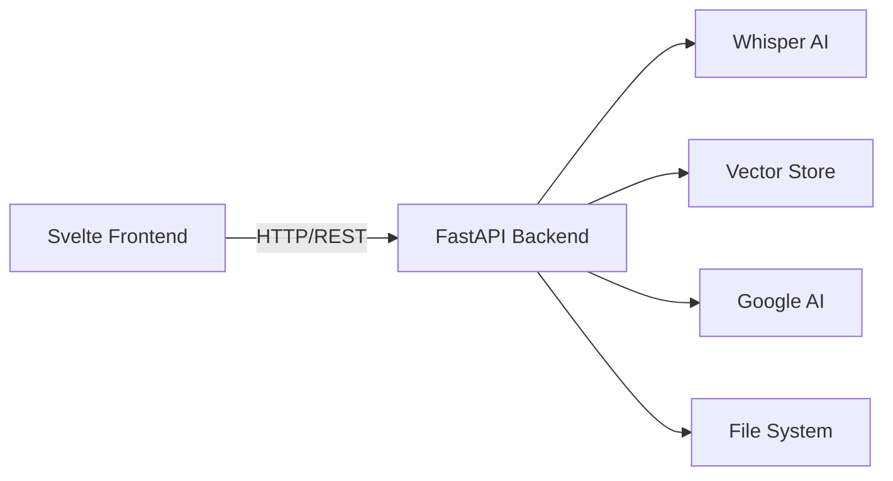

# Svelte + Bit UI + Tailwind Migration Plan

## Overview

This document outlines the comprehensive plan to migrate the BBC Audio Scraper application from Gradio (Python-based UI) to a modern web stack using **Svelte 5**, **Bit UI**, and **Tailwind CSS**.

## Architecture Overview

### Current Stack (Gradio)
- **Frontend**: Gradio (Python-generated UI)
- **Backend**: Python (integrated with Gradio)
- **Deployment**: Single Python process

### Target Stack (Svelte)
- **Frontend**: Svelte 5 + Bit UI + Tailwind CSS
- **Backend**: FastAPI (REST API)
- **Deployment**: Separate frontend and backend services



---

## Phase 1: Backend API Development

### 1.1 Create FastAPI Backend

**Directory Structure**:
```
backend/
├── api/
│   ├── __init__.py
│   ├── main.py              # FastAPI app
│   ├── routes/
│   │   ├── __init__.py
│   │   ├── downloads.py     # Download endpoints
│   │   ├── transcripts.py   # Transcription endpoints
│   │   ├── chat.py          # Chat endpoints
│   │   ├── history.py       # History endpoints
│   │   └── files.py         # File management endpoints
│   ├── models/
│   │   ├── __init__.py
│   │   ├── requests.py      # Pydantic request models
│   │   └── responses.py     # Pydantic response models
│   └── middleware/
│       ├── __init__.py
│       ├── cors.py          # CORS configuration
│       └── auth.py          # Optional authentication
├── src/                     # Existing Python modules (reused)
├── requirements.txt
└── README.md
```

**Key Endpoints**:

```python
# Downloads
POST   /api/downloads/rss              # Download from RSS feed
POST   /api/downloads/iplayer          # Download with get_iplayer
GET    /api/downloads                  # List downloaded files

# Transcripts
POST   /api/transcripts/transcribe     # Transcribe single file
POST   /api/transcripts/batch          # Transcribe all files
GET    /api/transcripts                # List transcripts
GET    /api/transcripts/{id}           # Get transcript content
POST   /api/transcripts/{id}/export    # Export to PDF

# Chat
POST   /api/chat/load-vectors          # Load transcripts to vector store
POST   /api/chat/message               # Send chat message
POST   /api/chat/sessions              # Create new session
GET    /api/chat/sessions              # List sessions
GET    /api/chat/sessions/{id}         # Get session
DELETE /api/chat/sessions/{id}         # Delete session
POST   /api/chat/sessions/{id}/export  # Export session

# History
GET    /api/history/listening          # Get listening history
POST   /api/history/listening          # Mark content accessed
PUT    /api/history/listening/{id}     # Mark as completed
GET    /api/history/stats              # Get statistics

# Files
GET    /api/files/audio                # List audio files
GET    /api/files/audio/{id}           # Stream audio file
GET    /api/files/pdfs                 # List PDFs
GET    /api/files/pdfs/{id}            # Get PDF file
```

### 1.2 WebSocket Support (Optional)

For real-time transcription progress and chat streaming:

```python
# WebSocket endpoints
WS     /ws/transcription/{task_id}     # Transcription progress
WS     /ws/chat                        # Streaming chat responses
```

---

## Phase 2: Frontend Development

### 2.1 Initialize Svelte Project

```bash
cd svelte-migration
npm create vite@latest frontend -- --template svelte-ts
cd frontend
npm install
```

### 2.2 Install Dependencies

```bash
# Core dependencies
npm install -D tailwindcss postcss autoprefixer
npm install bits-ui
npm install lucide-svelte          # Icons
npm install @tanstack/svelte-query # Data fetching
npm install axios                  # HTTP client
npm install svelte-sonner          # Toast notifications
npm install clsx tailwind-merge    # Utility functions

# Development
npm install -D @sveltejs/adapter-node
npm install -D vite-plugin-tailwind-purgecss
```

### 2.3 Configure Tailwind CSS

**`tailwind.config.js`**:
```javascript
/** @type {import('tailwindcss').Config} */
export default {
  content: ['./src/**/*.{html,js,svelte,ts}'],
  theme: {
    extend: {
      colors: {
        // Custom color palette
        primary: {
          50: '#f0f9ff',
          100: '#e0f2fe',
          // ... more shades
        },
      },
    },
  },
  plugins: [],
}
```

### 2.4 Project Structure

```
frontend/
├── src/
│   ├── lib/
│   │   ├── components/
│   │   │   ├── ui/              # Bit UI components
│   │   │   │   ├── button.svelte
│   │   │   │   ├── card.svelte
│   │   │   │   ├── dialog.svelte
│   │   │   │   ├── dropdown.svelte
│   │   │   │   ├── tabs.svelte
│   │   │   │   └── ...
│   │   │   ├── downloads/
│   │   │   │   ├── RSSDownloader.svelte
│   │   │   │   ├── IPlayerDownloader.svelte
│   │   │   │   └── DownloadsList.svelte
│   │   │   ├── transcripts/
│   │   │   │   ├── TranscriptList.svelte
│   │   │   │   ├── TranscriptionForm.svelte
│   │   │   │   └── PDFExporter.svelte
│   │   │   ├── reader/
│   │   │   │   ├── PDFViewer.svelte
│   │   │   │   ├── AudioPlayer.svelte
│   │   │   │   └── ContentSelector.svelte
│   │   │   ├── chat/
│   │   │   │   ├── ChatInterface.svelte
│   │   │   │   ├── MessageBubble.svelte
│   │   │   │   └── SourceCitation.svelte
│   │   │   └── history/
│   │   │       ├── ListeningHistory.svelte
│   │   │       ├── ChatHistory.svelte
│   │   │       └── StatisticsCard.svelte
│   │   ├── api/
│   │   │   ├── client.ts        # Axios instance
│   │   │   ├── downloads.ts     # Download API calls
│   │   │   ├── transcripts.ts   # Transcript API calls
│   │   │   ├── chat.ts          # Chat API calls
│   │   │   └── history.ts       # History API calls
│   │   ├── stores/
│   │   │   ├── downloads.ts     # Download state
│   │   │   ├── transcripts.ts   # Transcript state
│   │   │   ├── chat.ts          # Chat state
│   │   │   └── history.ts       # History state
│   │   ├── types/
│   │   │   └── index.ts         # TypeScript types
│   │   └── utils/
│   │       ├── format.ts        # Formatting utilities
│   │       └── constants.ts     # Constants
│   ├── routes/
│   │   ├── +layout.svelte       # Root layout
│   │   ├── +page.svelte         # Home page
│   │   ├── downloads/
│   │   │   └── +page.svelte     # Downloads page
│   │   ├── transcripts/
│   │   │   └── +page.svelte     # Transcripts page
│   │   ├── reader/
│   │   │   └── +page.svelte     # PDF Reader page
│   │   ├── chat/
│   │   │   └── +page.svelte     # Chat page
│   │   └── history/
│   │       └── +page.svelte     # History page
│   ├── app.css                  # Global styles
│   └── app.html                 # HTML template
├── static/
│   └── favicon.png
├── package.json
├── svelte.config.js
├── tailwind.config.js
├── tsconfig.json
└── vite.config.ts
```

---

## Phase 3: Component Implementation

### 3.1 UI Component Library (Bit UI)

Create reusable UI components using Bit UI primitives:

**Example: Button Component**
```svelte
<!-- src/lib/components/ui/button.svelte -->
<script lang="ts">
  import { Button as ButtonPrimitive } from 'bits-ui';
  import { cn } from '$lib/utils';
  
  export let variant: 'default' | 'primary' | 'secondary' | 'ghost' = 'default';
  export let size: 'sm' | 'md' | 'lg' = 'md';
  
  const variants = {
    default: 'bg-gray-100 hover:bg-gray-200 text-gray-900',
    primary: 'bg-blue-600 hover:bg-blue-700 text-white',
    secondary: 'bg-green-600 hover:bg-green-700 text-white',
    ghost: 'hover:bg-gray-100 text-gray-700'
  };
  
  const sizes = {
    sm: 'px-3 py-1.5 text-sm',
    md: 'px-4 py-2 text-base',
    lg: 'px-6 py-3 text-lg'
  };
</script>

<ButtonPrimitive.Root
  class={cn(
    'rounded-lg font-medium transition-colors',
    variants[variant],
    sizes[size],
    $$props.class
  )}
  {...$$restProps}
>
  <slot />
</ButtonPrimitive.Root>
```

### 3.2 Feature Components

**Example: Chat Interface**
```svelte
<!-- src/lib/components/chat/ChatInterface.svelte -->
<script lang="ts">
  import { chatStore } from '$lib/stores/chat';
  import { sendMessage } from '$lib/api/chat';
  import MessageBubble from './MessageBubble.svelte';
  import Button from '$lib/components/ui/button.svelte';
  
  let message = '';
  let loading = false;
  
  async function handleSend() {
    if (!message.trim()) return;
    
    loading = true;
    try {
      await sendMessage(message);
      message = '';
    } catch (error) {
      console.error('Failed to send message:', error);
    } finally {
      loading = false;
    }
  }
</script>

<div class="flex flex-col h-full">
  <!-- Messages -->
  <div class="flex-1 overflow-y-auto p-4 space-y-4">
    {#each $chatStore.messages as msg}
      <MessageBubble {msg} />
    {/each}
  </div>
  
  <!-- Input -->
  <div class="border-t p-4">
    <form on:submit|preventDefault={handleSend} class="flex gap-2">
      <input
        bind:value={message}
        placeholder="Ask a question..."
        class="flex-1 px-4 py-2 border rounded-lg"
        disabled={loading}
      />
      <Button type="submit" variant="primary" disabled={loading}>
        {loading ? 'Sending...' : 'Send'}
      </Button>
    </form>
  </div>
</div>
```

---

## Phase 4: State Management

### 4.1 Svelte Stores

**Example: Chat Store**
```typescript
// src/lib/stores/chat.ts
import { writable } from 'svelte/store';
import type { ChatMessage, ChatSession } from '$lib/types';

interface ChatState {
  currentSession: ChatSession | null;
  messages: ChatMessage[];
  loading: boolean;
}

function createChatStore() {
  const { subscribe, set, update } = writable<ChatState>({
    currentSession: null,
    messages: [],
    loading: false
  });

  return {
    subscribe,
    addMessage: (message: ChatMessage) => {
      update(state => ({
        ...state,
        messages: [...state.messages, message]
      }));
    },
    setLoading: (loading: boolean) => {
      update(state => ({ ...state, loading }));
    },
    clearMessages: () => {
      update(state => ({ ...state, messages: [] }));
    }
  };
}

export const chatStore = createChatStore();
```

### 4.2 TanStack Query Integration

```typescript
// src/lib/api/chat.ts
import { createQuery, createMutation } from '@tanstack/svelte-query';
import { apiClient } from './client';

export function useChatSessions() {
  return createQuery({
    queryKey: ['chat-sessions'],
    queryFn: async () => {
      const { data } = await apiClient.get('/api/chat/sessions');
      return data;
    }
  });
}

export function useSendMessage() {
  return createMutation({
    mutationFn: async (message: string) => {
      const { data } = await apiClient.post('/api/chat/message', { message });
      return data;
    }
  });
}
```

---

## Phase 5: Styling with Tailwind

### 5.1 Design System

**Color Palette**:
```javascript
// tailwind.config.js
theme: {
  extend: {
    colors: {
      primary: {
        50: '#eff6ff',
        500: '#3b82f6',
        600: '#2563eb',
        700: '#1d4ed8',
      },
      success: {
        500: '#10b981',
        600: '#059669',
      },
      warning: {
        500: '#f59e0b',
        600: '#d97706',
      },
      error: {
        500: '#ef4444',
        600: '#dc2626',
      }
    }
  }
}
```

### 5.2 Component Styling Examples

**Card Component**:
```svelte
<div class="bg-white rounded-lg shadow-md p-6 hover:shadow-lg transition-shadow">
  <slot />
</div>
```

**Responsive Layout**:
```svelte
<div class="grid grid-cols-1 md:grid-cols-2 lg:grid-cols-3 gap-4">
  <!-- Content -->
</div>
```

---

## Phase 6: Deployment

### 6.1 Development Setup

**`docker-compose.yml`**:
```yaml
version: '3.8'

services:
  backend:
    build: ./backend
    ports:
      - "8000:8000"
    volumes:
      - ./downloads:/app/downloads
      - ./transcripts:/app/transcripts
      - ./data:/app/data
    environment:
      - GOOGLE_AI_API_KEY=${GOOGLE_AI_API_KEY}
  
  frontend:
    build: ./frontend
    ports:
      - "5173:5173"
    depends_on:
      - backend
    environment:
      - VITE_API_URL=http://localhost:8000
```

### 6.2 Production Build

**Frontend**:
```bash
npm run build
```

**Backend**:
```bash
uvicorn api.main:app --host 0.0.0.0 --port 8000
```

---

## Migration Checklist

### Backend (FastAPI)
- [ ] Create FastAPI project structure
- [ ] Implement download endpoints
- [ ] Implement transcription endpoints
- [ ] Implement chat endpoints
- [ ] Implement history endpoints
- [ ] Add CORS middleware
- [ ] Add error handling
- [ ] Add request validation (Pydantic)
- [ ] Add API documentation (Swagger)
- [ ] Add WebSocket support (optional)

### Frontend (Svelte)
- [ ] Initialize Svelte project
- [ ] Configure Tailwind CSS
- [ ] Set up Bit UI components
- [ ] Create UI component library
- [ ] Implement Downloads page
- [ ] Implement Transcripts page
- [ ] Implement PDF Reader page
- [ ] Implement Chat page
- [ ] Implement History page
- [ ] Add state management (stores)
- [ ] Add API client
- [ ] Add error handling
- [ ] Add loading states
- [ ] Add responsive design
- [ ] Add dark mode (optional)

### Testing
- [ ] Backend unit tests
- [ ] Backend integration tests
- [ ] Frontend component tests
- [ ] E2E tests (Playwright)
- [ ] Performance testing

### Deployment
- [ ] Docker configuration
- [ ] Environment variables
- [ ] Production build
- [ ] Deployment documentation

---

## Timeline Estimate

- **Phase 1 (Backend)**: 2-3 days
- **Phase 2 (Frontend Setup)**: 1 day
- **Phase 3 (Components)**: 3-4 days
- **Phase 4 (State Management)**: 1-2 days
- **Phase 5 (Styling)**: 2 days
- **Phase 6 (Deployment)**: 1 day
- **Testing & Polish**: 2-3 days

**Total**: ~12-16 days

---

## Benefits of Migration

1. **Modern Tech Stack**: Latest web technologies
2. **Better Performance**: Faster load times, reactive UI
3. **Improved UX**: Smoother interactions, better animations
4. **Scalability**: Separate frontend/backend can scale independently
5. **Developer Experience**: TypeScript, better tooling
6. **Customization**: Full control over UI/UX
7. **Mobile Responsive**: Better mobile experience

---

## Next Steps

1. Review this plan and provide feedback
2. Set up backend FastAPI structure
3. Create initial Svelte project
4. Implement core API endpoints
5. Build first UI components
6. Iterate and test

Would you like me to start implementing any specific phase?
